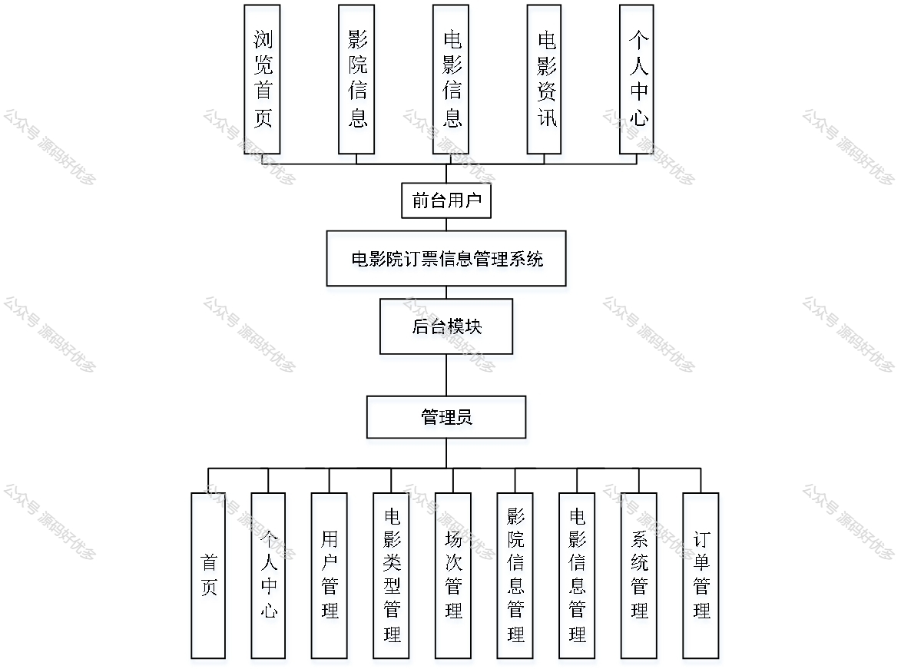
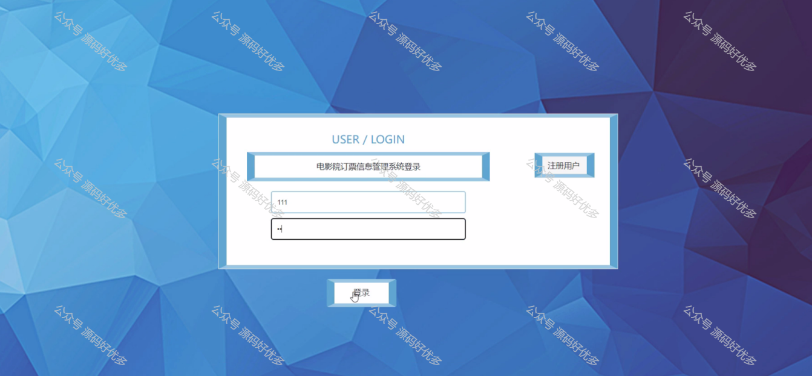
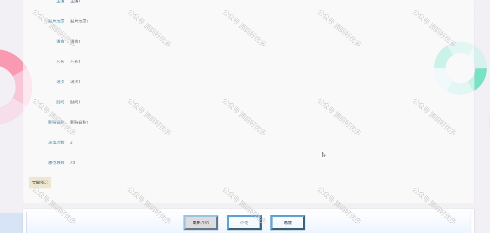
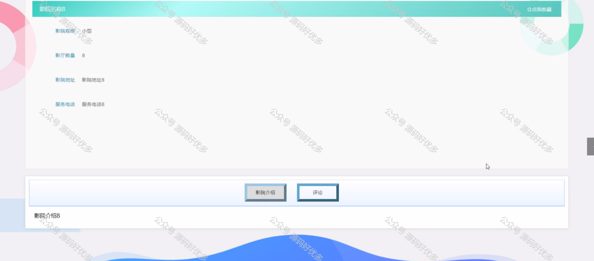
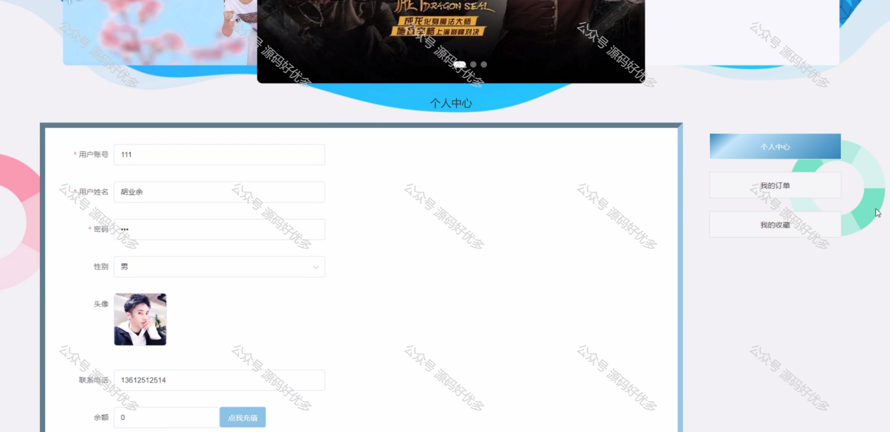
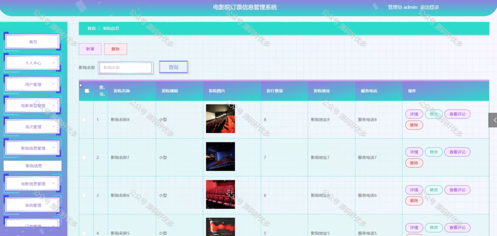
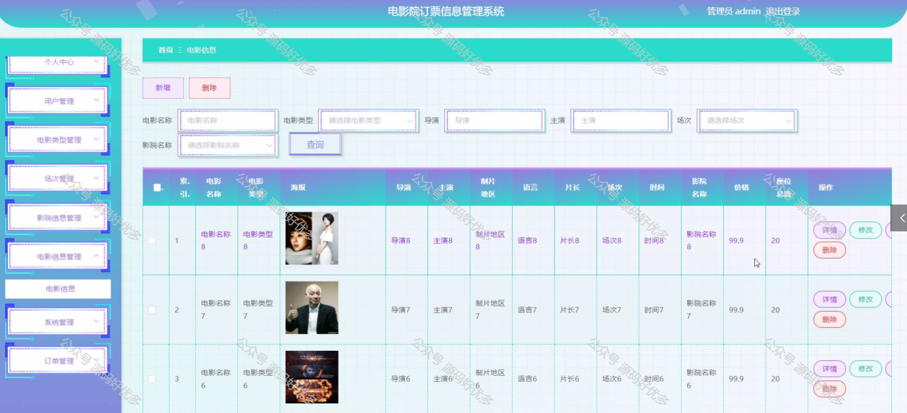
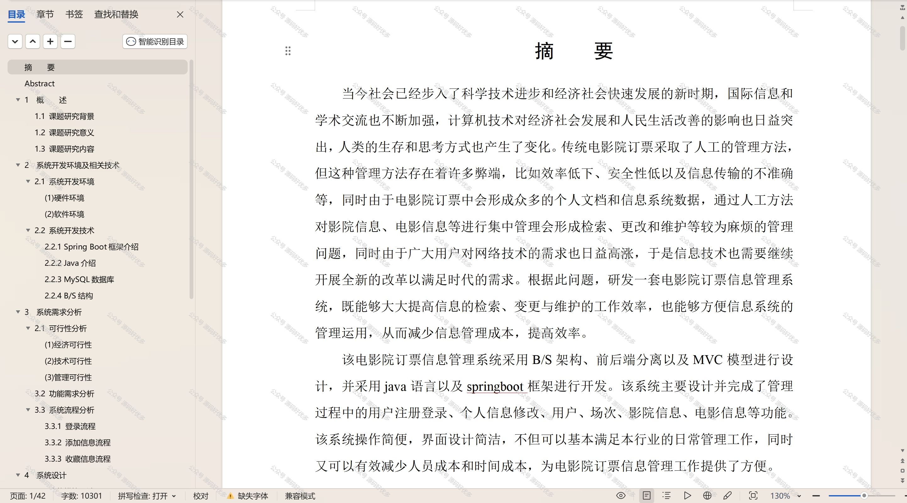

 
## 查看主页获取源码

> **作者介绍**： **✌**全网粉丝10W+本平台特邀作者、博客专家、CSDN新星计划导师、java领域优质创作者,博客之星、掘金/华为云/阿里云/InfoQ等平台优质作者、专注于项目实战 **✌**

  

### 一、作品包含

源码+数据库+设计文档万字+PPT+全套环境和工具资源+部署教程

### 二、项目技术

前端技术：Html、Css、Js、Vue、Element-ui

数据库：MySQL

后端技术：Java、Spring Boot、MyBatis

  

### 三、运行环境

开发工具：IDEA/eclipse

数据库：MySQL5.7

数据库管理工具：Navicat10以上版本

环境配置软件： JDK1.8+Maven3.6.3

前端Nodejs：14

### 四、项目介绍
项目编号：springbootA146

电影院订票信息管理系统是为了满足现代电影放映行业的需求，提供一种高效、便捷的在线购票体验而设计。不仅方便了观众快速获取电影信息并完成订票，同时也帮助电影院优化了服务流程，提高了运营效率，实现了信息化管理。

前台用户功能：浏览首页、影院信息、电影信息、电影资讯、个人中心。

后台管理员的功能：首页、个人中心、用户管理、电影类型管理、场次管理、影院信息管理、电影信息管理、系统管理和订单管理。

### 五、运行截图

  
